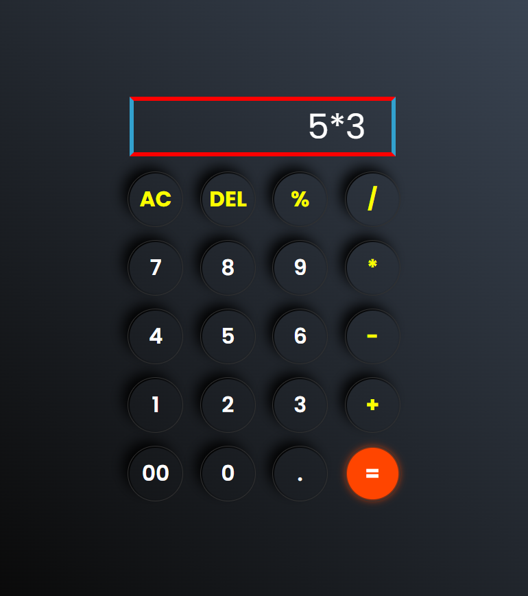

# 🧮 Calculator Web Application

A fully functional, responsive, and beginner-friendly **Calculator Web Application** developed using **HTML, CSS, and JavaScript**.  
This project focuses on implementing core JavaScript logic, clean UI design, and real-world front-end development practices.

The calculator performs all basic arithmetic operations with a smooth user experience and minimalistic interface.  
It is designed to be lightweight, fast, and easy to understand, making it ideal for learning and demonstration purposes.

---

## 📌 Project Overview

This calculator application allows users to perform common mathematical calculations directly in the browser without any external libraries or frameworks.  
The project is built with a strong focus on **clarity, simplicity, and usability**, following standard front-end development conventions.

It serves as a great example of:
- JavaScript DOM manipulation
- Event handling
- UI interaction logic
- Front-end project structuring
- GitHub project documentation

---

## ✨ Features

- ➕ Addition of numbers  
- ➖ Subtraction of numbers  
- ✖️ Multiplication support  
- ➗ Division functionality  
- 🧹 Clear / Reset button  
- ⌫ Delete / Backspace support *(if implemented)*  
- 📱 Fully responsive layout  
- 🎨 Clean and modern user interface  
- ⚡ Instant calculation without page reload  

---

## 🛠️ Tech Stack Used

- **HTML5**
  - Semantic structure
  - Input & button elements
- **CSS3**
  - Flexbox/Grid layout
  - Responsive design
  - Button styling & hover effects
- **JavaScript (ES6)**
  - Event listeners
  - DOM manipulation
  - Calculation logic
  - Error handling (division by zero, empty input, etc.)

---
```text
calculator-web-app/
│
├── index.html # Main HTML file
├── style.css # Styling and layout
├── script.js # Calculator logic
├── screenshot.png # Project preview image
└── README.md # Project documentation
```
📸 Screenshots

Below is a preview of the calculator interface:


---
🤝 Contributing

Contributions are welcome!

If you’d like to improve this project:

Fork the repository

Create a new feature branch

Commit your changes

Open a Pull Request

Suggestions and feedback are always appreciated.
---
📬 Contact & Author

Peeyush Tiwari
🎓 Software Engineering Student
💻 Front-End / MERN Stack Developer
📍 India

🔗 GitHub: https://github.com/your-username

💼 LinkedIn: https://www.linkedin.com/in/your-link
---
⭐ Support

If you found this project useful or learned something new,
please consider giving the repository a star ⭐ — it really helps!


## 📁 Folder Structure

